# Como usar o Github com o VSCode
Github é uma plataforma para hospedagem de código-fonte e arquivos, e utilizado por programadores do mundo todo. Com o Git e Github é possível salvar e compartilhar seu código de forma prática.

Caso queira saber mais sobre Git e Github, acesse esses vídeos por recomendação minha.

- [Rafaella Ballerini](https://youtu.be/DqTITcMq68k?si=IZrRDynEVx-VCOkZ)
- [Thi Code](https://youtu.be/7cNP3AE49Bg?si=Qt-Qsw65vQMUfI5t)

Esse tutorial é mais específico para quem deseja entregar as atividades com o Github ou ter mais interação com a plataforma.

---

## Pré requisitos
Para esse tutorial é necessário ter instalado na sua máquina:
 - Git [download](https://git-scm.com/downloads)
 - VSCode [download](https://code.visualstudio.com/download)

---

## Crie uma conta
- Acesse [github.com/signup](https://github.com/signup) e crie sua conta. Recomendo usar seu `email pessoal`.

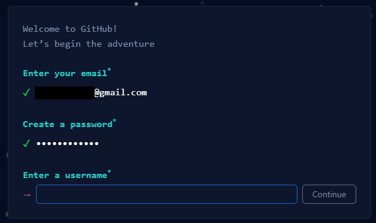

- Ao criar sua conta, faça o login. Pode pular a personalização, clique em `Skip Personalization`.

---

## Configurando nome e sobrenome
- Acesse seu perfil. Clique na sua `Foto de Perfil > Your Profile`. Ou acesse `github.com/seu-username`

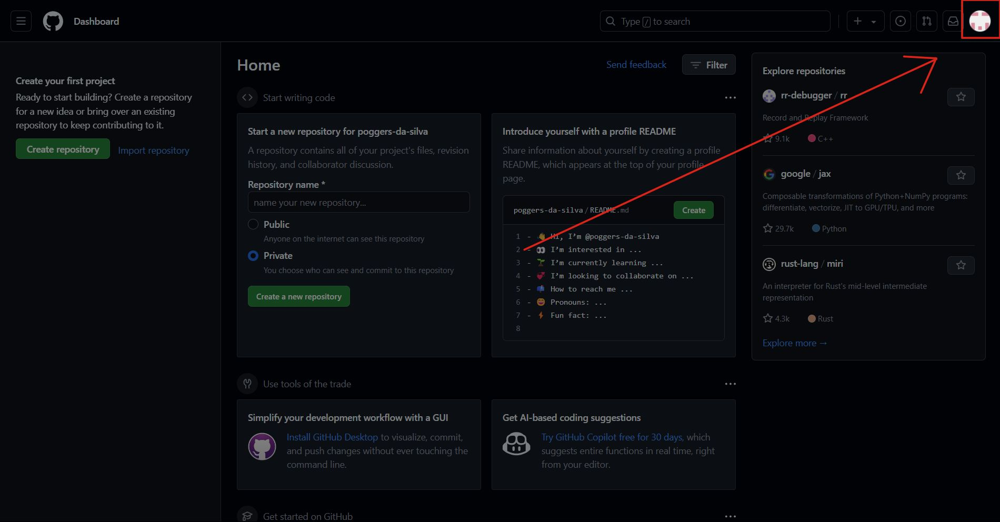

- Clique em `Edit Profile` e coloque seu nome e sobrenome.

- Se quiser, coloque uma foto de perfil também!

> Se liga nesse Antes e Depois!
>
>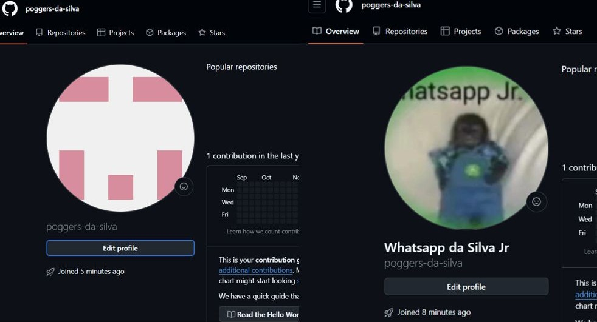

---

## Crie um fork
- Acesse o [repositório das Atividades do TAL](https://github.com/dvanael/tal-peoo-atividades/), e crie um fork para seu usuário.

- Clique em `Fork`.

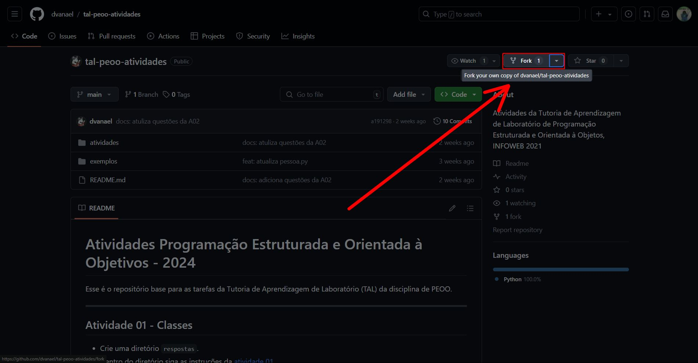

- Espere a página carregar e clique em `Create Fork`.

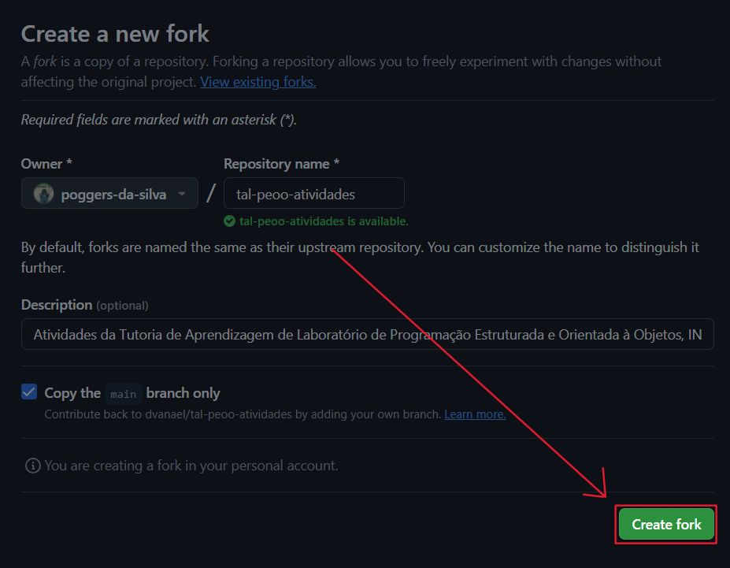

Agora você tem uma cópia do repositório de atividades para enviar as repostas.

---

## Clonando no VScode
- No seu repositório fork, clique em `Code` e copie o link `HTTPS`.

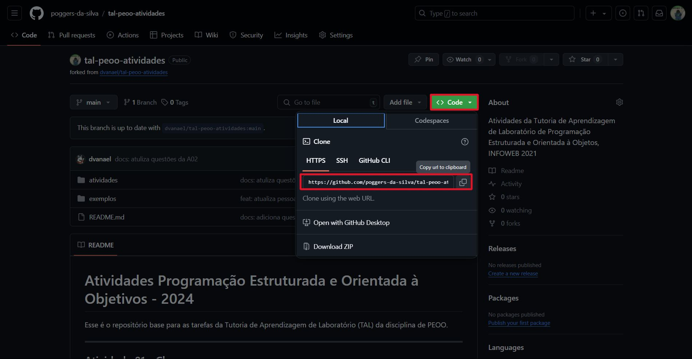

- No VSCode, acesse a aba `Source Control` do VSCode e clique em `Clone Repository`.

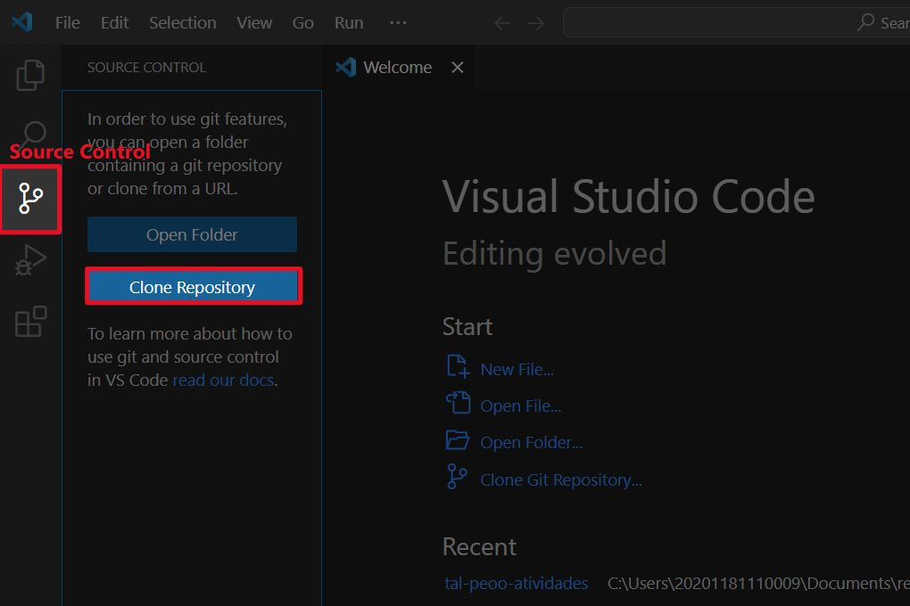

- Cole o link ``.git`` do seu repositório.

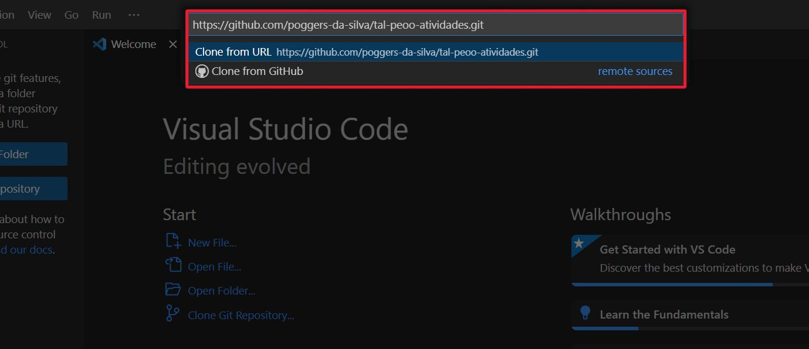

- Escolha uma pasta salvar o repositório.

O VSCode vai automaticamente perguntar se você quer abrir a pasta do repositório.

Agora, você pode criar novos arquivos no repositório. Use os nomes sugeridos nas atividades para os arquivos das respostas.

### DICAS
Aperte **Ctrl+V** nos arquivos `.md` para ter uma visualização melhor!

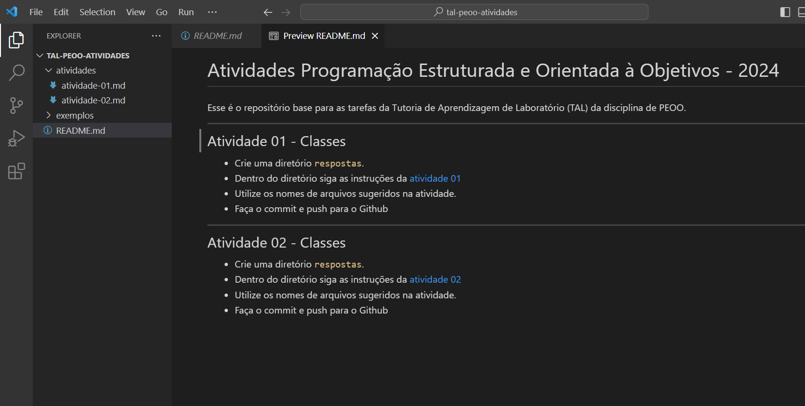

---

## Fazendo commits
Depois de criar novos arquivos ou fazer alterações, você pode enviar essas mudanças para seu repositório online no Github.

- Abra um novo terminal no VSCode.

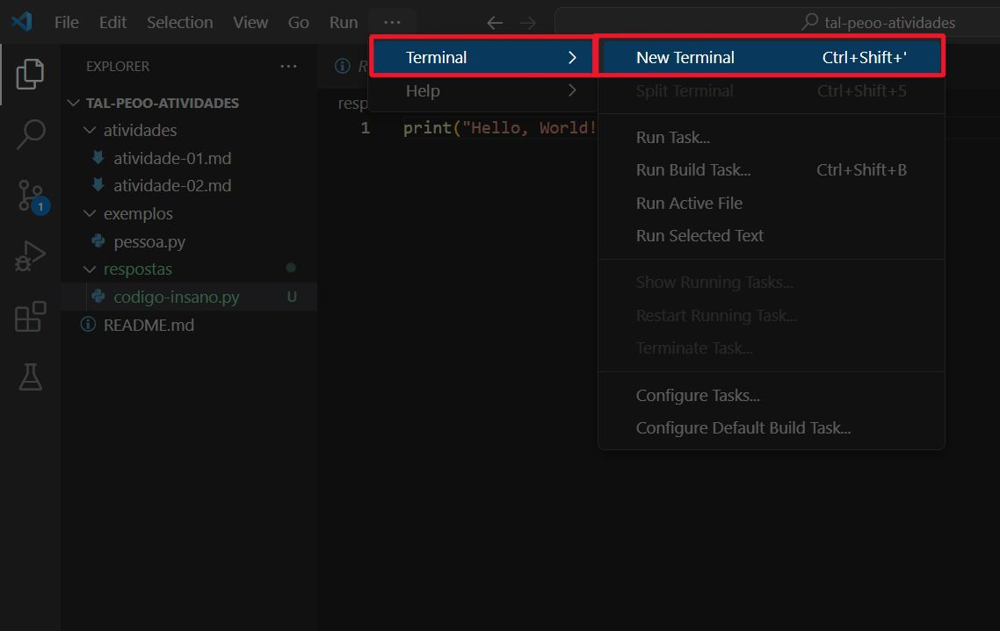

- No terminal, digite os comando seguir. Seu `email` e `username` devem ser iguais ao Github, assim sua conta será reconhecida.

```powershell
git config --global user.email "seu-email"
```

```powershell
git config --global user.name "seu-username"
```

- Com as alterações feitas, acesse a aba `Source Control`.

- Adicione os arquivos de `Changes` para `Staged`.

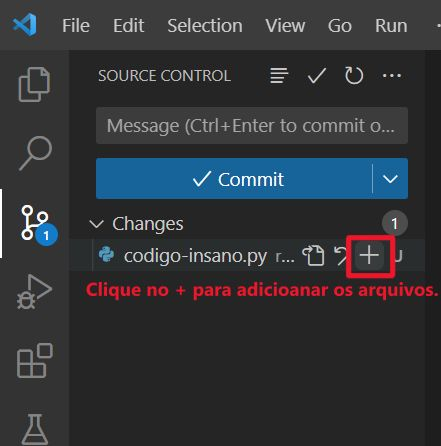

- Adicione uma mensagem para seu commit.

- Clique em `Commit` e, depois de carregar, `Sync Changes`

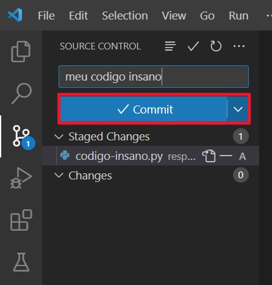


- Git pedirá para fazer login, caso não esteja logado no Github em seu navegador padrão.

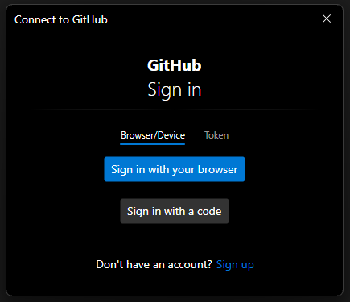

Agora as suas alterações estão no repositório do Github!

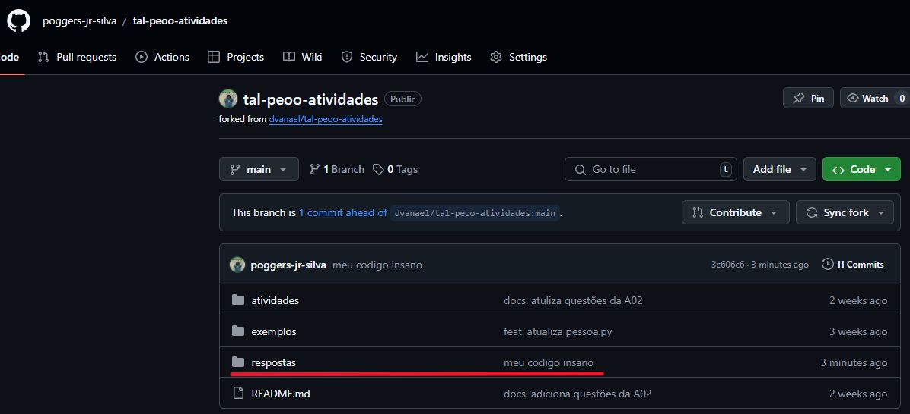

---

## Dúvidas

Em caso de dúvidas ou algum erro, fale com o bolsista no laboratório ou mande um email para `anael.b@escolar.ifrn.edu.br`

---